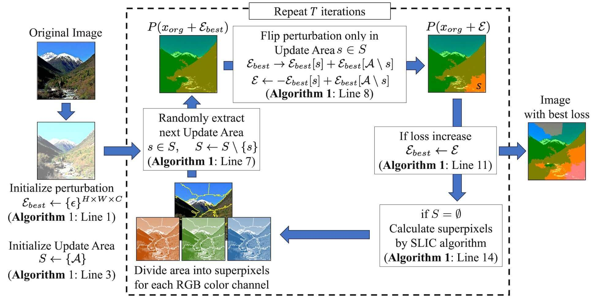

# Superpixel Attack

    Superpixel Attack: Enhancing Black-box Adversarial Attack with Image-driven Division Areas



## Setup

Login [image-net.org](https://image-net.org/login.php) and download
[ILSVRC2012_img_val.tar](https://image-net.org/data/ILSVRC/2012/ILSVRC2012_img_val.tar),
[ILSVRC2012_devkit_t12.tar.gz](https://image-net.org/data/ILSVRC/2012/ILSVRC2012_devkit_t12.tar.gz).

Set `ILSVRC2012_img_val.tar` and `ILSVRC2012_devkit_t12.tar.gz` in
`storage/data/`.

Then run

```
pip install -r requirements.txt
```

## Usage

```
python main.py -c <path_to_config> -g <gpu-id> -t <num_thread> -p <params_to_override>
```

For example:

```
python main.py -c ../config/superpixel_attack.yaml -g 0 -t 10
```

```
python main.py -c ../config/sign_hunter.yaml -g 1 -t 20 -p model=Wong2020Fast iter=1000
```
